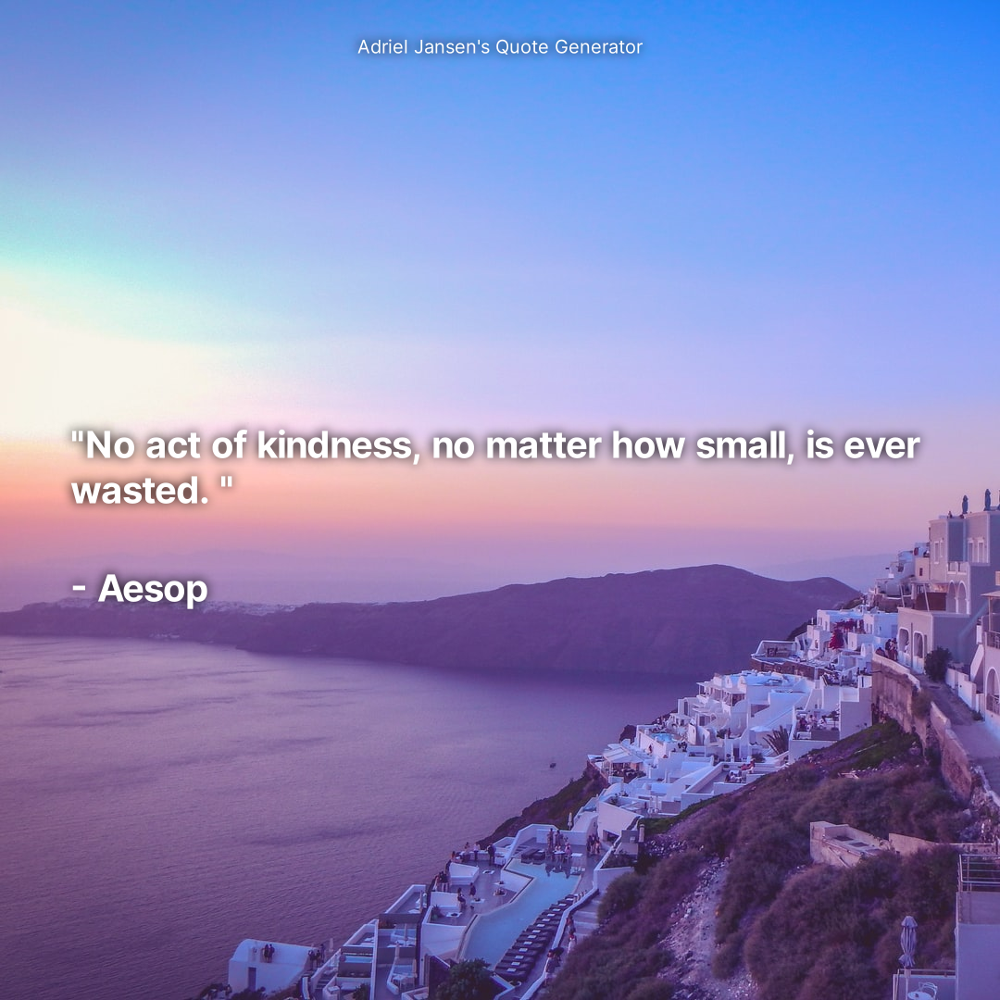
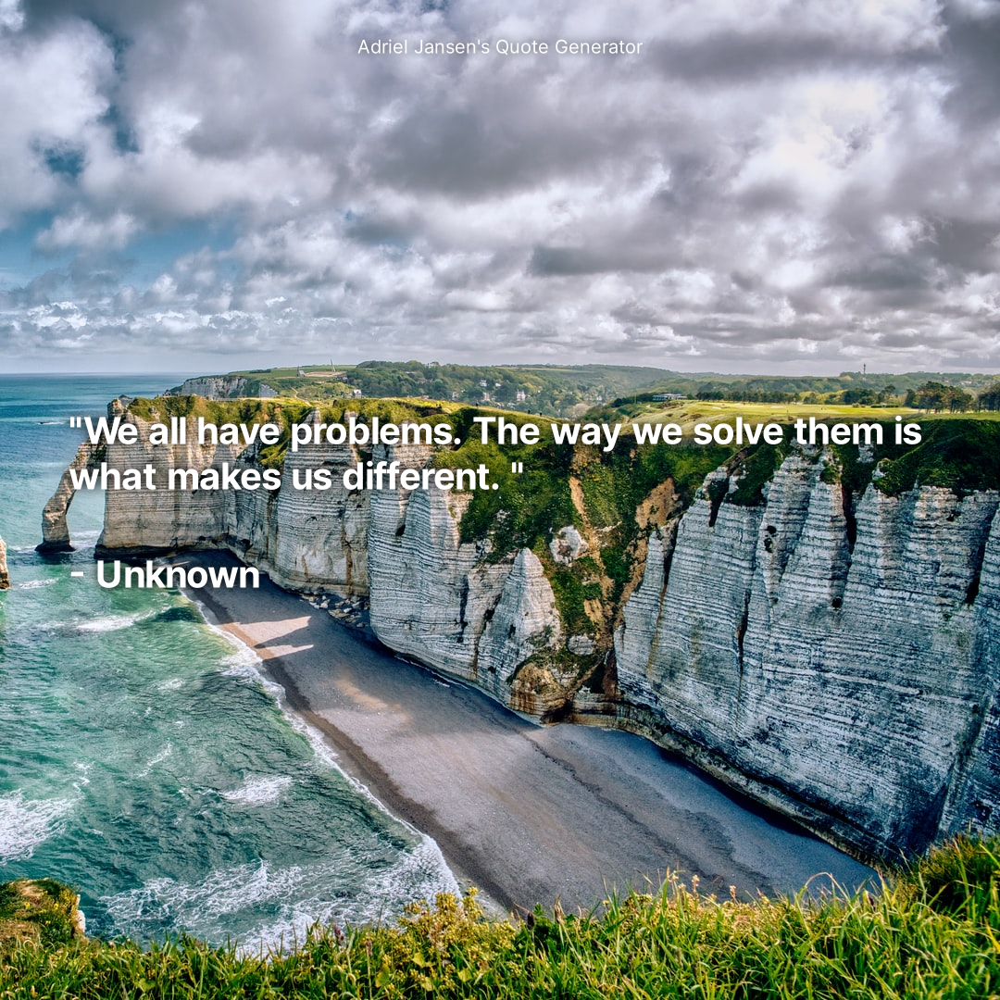
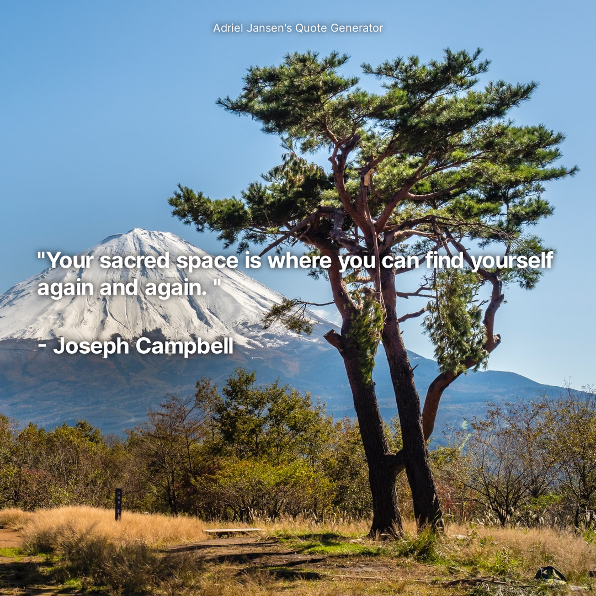

# Adriel's Quote Generator
Creates a random quote with an image behind it, using Unsplash.

Examples:




Setup:
```sh
$ npm i . # installs all required dependencies.
```

then,
```sh
$ node .
```

or (nodemon required)
```sh
$ npm run dev
```

Enjoy!